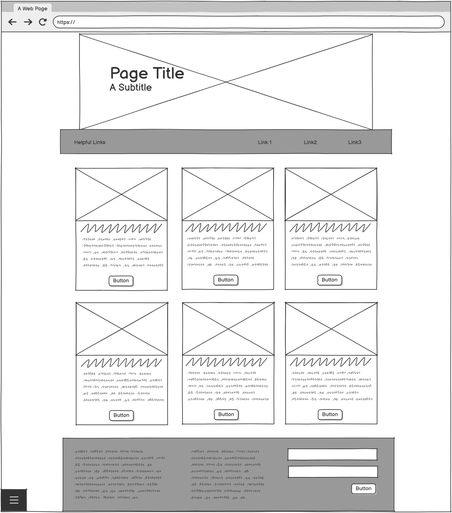
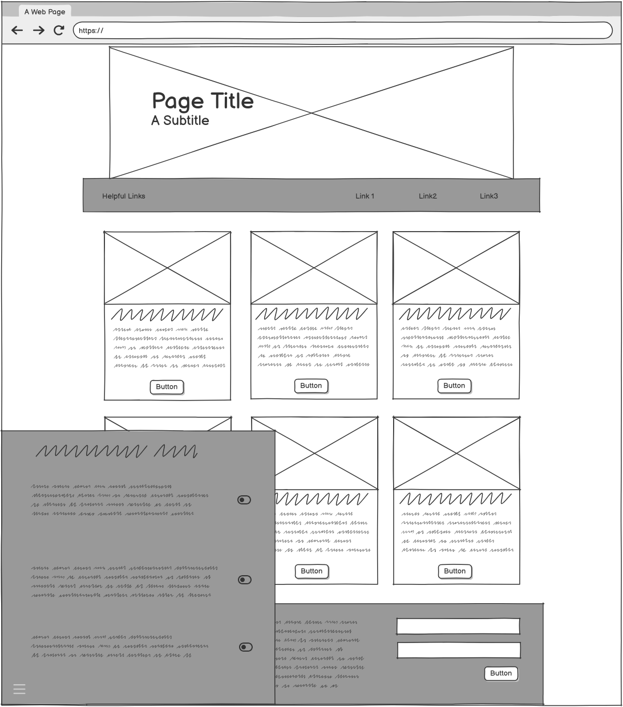
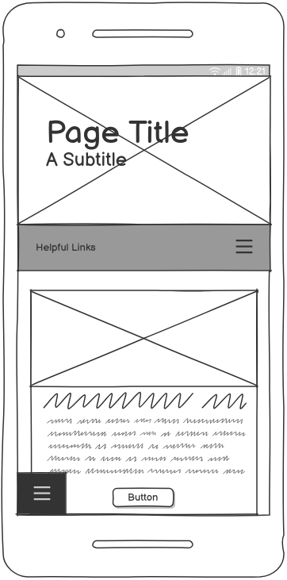
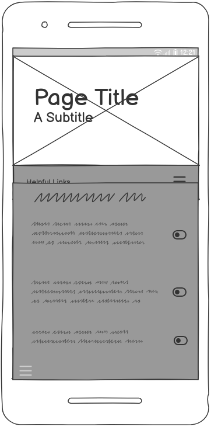
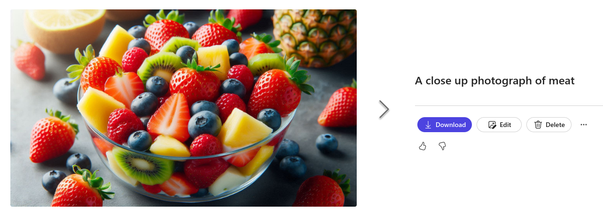
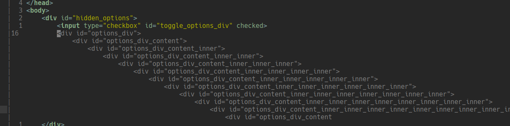

# This Website Is Terrible

First project for the Code Institute Full Stack Developer course.

A tongue-in-cheek approach to a a mental health awareness website. The user transforms an intentionally bad website into a more positive and helpful one. In much the same way that pressure-washing a dirty patio is a cathartic and enjoyable experience, so too is the process of transforming this website into something better.

Features include:
- Swapping out text content
- Swapping out images
- Fixing colours
- Fixing layout
- adding useful links
- embedded video in interactive popover modals

Given the stage of the course, I have intentionally avoided the use of Javascript for this so **all interactivity is done through HTML and CSS only**.

## Key Objectives

- Ultimately produce a visually clean and informative website
- responsive design at all times, irrespective of user-selected options
- showcase some advanced CSS techniques

## UX Design

### User Stories

- AS A Site User, I WANT TO navigate easily through the website SO THAT I CAN find the information I need.
- AS A Site User, I WANT TO understand the goal of the website immediately upon arrival SO THAT I CAN get a visual understanding of its purpose
- AS A visitor, I WANT TO access relevant external links SO THAT I CAN find additional resources and information on mental health and wellbeing.
- AS A visitor, I WANT TO read short paragraphs on simple mental health strategies SO THAT I CAN easily understand and implement them in my daily life.
- AS A user, I WANT TO subscribe to a newsletter SO THAT I CAN receive regular updates on mental health tips.
- AS a visitor, I WANT TO identify bad mental health strategies SO THAT I CAN understand the differences and make better choices for my wellbeing.
- AS a visitor, I WANT TO see highlights of good and bad website design for mental wellbeing SO THAT I CAN understand the impact of design choices on user experience and mental health.

### Wireframes

These have been created using [Balsamiq](https://balsamiq.com/) to define the layout on the "good" version of the page. The "bad" version of the page is a distorted version of the "good" version.

#### Desktop
 

#### Mobile
 

## Colours

The following colours were used for the "good" version of the page:

--color-body: #64c5cc;
--color-primary: rgb(0, 41, 61);
--color-primary-ghost: rgba(0, 41, 61, .3);
--color-secondary: #1f6831;
--color-secondary-hover: #397f46;

The bad version of the page had colours chosen to be jarring and unpleasant. They do not follow a theme and are not harmonious on purpose.

## Fonts

For the "good" version of the page, I used the `Roboto` font-family for the body of the page. This is a clean and modern sans-serif font that is easy to read and looks professional. For the masthead of the page I used `Fira Sans` as it provided a nice contrast to the body font.

On the "bad" version of the page, I used `Creepster` for the masthead as it seemed wholly inappropriate given the subject matter. For the body I used a monospace font called `Nova Mono` to make the page harder to read.

## Icons

I opted to use rounded Material Design icons from Google's Material Design Icons library. I prefer these to font awesome as I can specify which icons I want to use and not have to load the entire library, I can apply things like a `font-weight` to them, and also they do not require require an account to use.

These are implemented using font ligatures. For example this displays the menu icon seen at the bottom corner of the page:

```html
<span class="material-symbols-rounded">menu</span>
```

## Imagery

For the "good" version of the page, I utilised Dall-E to create a series of low-poly images of relaxing scenery. I felt this was most approporiate as it avoids the uncanny valley of generating images of real people or real settings.

For the "bad" version of the page, Dall-E was used to create images that were intentionally jarring and unpleasant. This was to create a stark contrast between the two versions of the page. In this process I have discovered that Dall-E will suspend my account if I generate images it feels may possibly be offensive.

I was banned for the following images:
- a clown sharpening its teeth
- a dumpster fire in a serene setting

I also discovered that Dall-E will simply refuse to generate images of meat. Instead it will generate images of fruit or vegetables.



Believe it or not, this image is AI-generated:


## Content

All text-content was written by ChatGPT and edited by myself. The text was generated in a single pass and then edited for clarity and relevance.

I could not simply ask ChatGPT to generate the text for the "bad" version of the website as it tries very hard not to give incorrect or harmful advice, instead I had to trick it by feeding it the "good" version and asking it to provide the opposite advice.

Relevant external links were generated by https://www.perplexity.ai/ and edited for relevance. I found that ChatGPT had a tendency to simply make them up.

## Code Samples

The options for the page have been stored in a series of checkboxes in a hidden div at the top of the page. For example:


```html
<div id="hidden_options">
    <input type="checkbox" id="bad_images" checked>
    ...
</div>
```

From there the options can be accessed using the `:has` pseudo-class in CSS. For example, the following is the code to change the colour of the toggle switch for the "bad_images" option:

```css
#options label>span:after {
    content: 'toggle_on';
    display: inline-block;
    vertical-align: middle;
    font-size: 40px;
    font-weight: 900;
    cursor: pointer;
    color: green;
}

body:has(#bad_images:checked) #options label[for="bad_images"]>span:after {
    content: 'toggle_off';
    color: red;
}
```

Some options depend on the state of current options, for this I used the descendant sibling selector (`~`) within the `:has` pseudo-class. For example, the following code further adjusts the word spacing depending on whether a monospace font is `:not` being used:

```css
/* fix for when non-mono fonts are used */
body:has(#bad_text_spacing:checked ~ #bad_fonts:not(:checked)) footer,
body:has(#bad_text_spacing:checked ~ #bad_fonts:not(:checked)) .card {
    word-spacing: -.3ch;
}
```

AI was used sparingly for code completion. I found that it could become confused sometimes:



## Validation
